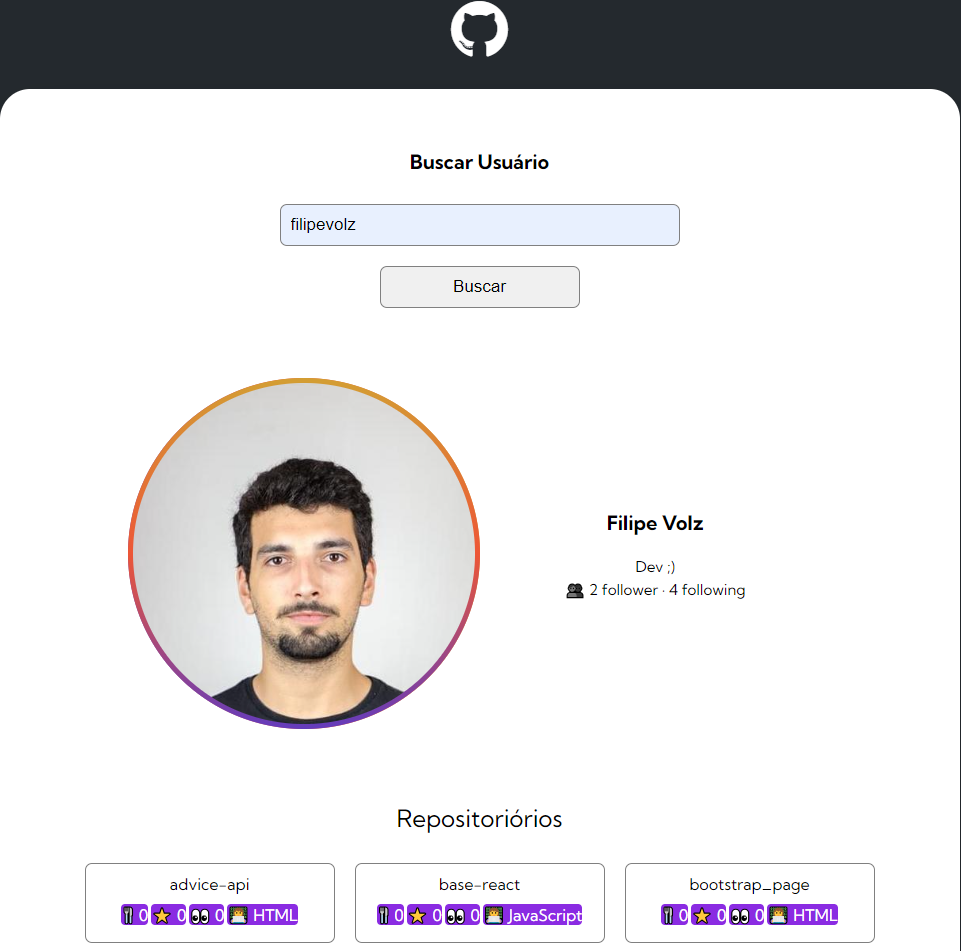

<h1 align="center"> Projeto com Fetch e Github API </h1>

## 🖥️ Projeto
Esse é um projeto Web utilizando fetch e API do Github para buscar informações dos usuários.

## 🚀 Tecnologias
Esse projeto foi desenvolvido utilizando as seguintes tecnologias:
- HTML
- CSS
- JAVASCRIPT
- GITHUB API
- Git e Github

## 📘 Artigo sobre a aplicação
<a>https://medium.com/@filipevolz/desenvolvendo-um-projeto-utilizando-a-api-do-github-6258fb857069</a>
